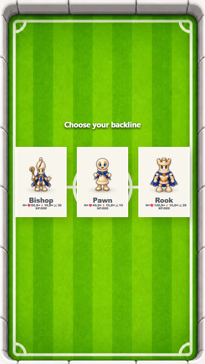

# Wave Spawn!

This demo is a minimal Babylon.js Lite-style project: one responsive 3D scene,
one glowing crystal, and a centered portrait game frame.

## Live Demo

https://samuelasherrivello.github.io/bablylon-lite-wave-spawn/latest/

The demo is published by GitHub Actions when a GitHub Release is published.

## Table of Contents

1. Getting Started
2. Project Overview
3. Project Details
4. OpenSpec
5. Resources
6. Credits

## Getting Started

### Play Project

1. Clone or download this repo.
2. Open the repository root in a command line.
3. Run `npm install` to install the project dependencies.
4. Run `npm run dev` to launch the local development server.
5. Open the URL printed by Vite.

### Release Workflow

1. Update `public/environment.json` so `releaseVersion` matches the planned release, then create a matching three-component GitHub Release tag such as `v0.1.5`.
2. Publish the release and wait for `ReleaseWebBuildToGithubPages` to finish.
3. Verify the root, `latest`, and versioned URLs on desktop and in a portrait mobile viewport.
4. Confirm the live line includes `releaseVersion` and the workflow-populated `downloadSize`, which is the total uncompressed browser-build size.

### More Commands

| # | Name | Command | Comment |
| --- | --- | --- | --- |
| 1 | Install | `npm install` | Installs Babylon.js and Vite. |
| 2 | Dev | `npm run dev` | Runs the app with hot reload. |
| 3 | Build | `npm run build` | Creates the production bundle. |
| 4 | Preview | `npm run preview` | Serves the production bundle locally. |

## Project Overview

The project uses Babylon.js for the 3D scene and Vite for local development
and production bundling. The game canvas keeps a 9:16 portrait aspect ratio and
is centered in the browser viewport, matching the inspiration project's mobile
presentation without copying its game systems or project structure.

### Structure

- `index.html`: The page shell and centered game frame.
- `src/main.js`: Babylon.js engine, camera, lights, and scene.
- `src/style.css`: Responsive portrait layout and visual styling.
- `AGENTS.md`: Mandatory repository instructions for AI coding agents.
- `docs/game-size-relative-layout.md`: Layout and scaling practices for game-frame features.

### Dependencies

- `@babylonjs/core`: Babylon.js rendering engine.
- `vite`: Development server and bundler.

## Project Details

This is intentionally a small starting point for experimenting with Babylon.js
Lite. Drag to orbit the camera and use the wheel or pinch gesture to zoom.

## OpenSpec

OpenSpec keeps the project’s feature intent and implementation requirements
visible in the repository.

- `openspec/config.yaml`: Project context and specification rules.
- `openspec/specs/portrait-game-frame/spec.md`: Responsive viewport contract.
- `openspec/changes/`: Proposed feature changes and their implementation tasks.

Typical change workflow:

1. Create a focused folder under `openspec/changes/`.
2. Add a proposal, design, specs, and tasks for the change.
3. Implement the change and verify its browser-visible scenarios.

### Visual Scaling Contract

Every future feature that adds or changes content inside the game frame must
preserve the composition's relative sizing and relative positioning as the
centered 9:16 frame resizes. Size and position visible artwork, controls, text,
spacing, borders, and effects from the game frame instead of fixed screen pixels
or the browser viewport. Verify each affected composition in a large desktop
viewport and a narrow portrait viewport.

If a feature intentionally needs reflow, a breakpoint, or another non-uniform
composition, define that exception explicitly in its OpenSpec requirements and
browser-visible acceptance scenarios before implementation.

See [Game-size-relative layout](docs/game-size-relative-layout.md) for unit
selection, positioning practices, examples, exceptions, and verification steps.

## Resources

- [Babylon.js Lite getting started](https://doc.babylonjs.com/lite/01-getting-started)
- [Babylon.js Documentation](https://doc.babylonjs.com/)
- [Vite Documentation](https://vite.dev/guide/)

## Credits

Created as a minimal Babylon.js learning project.

### License

Provided as-is under the MIT License.
